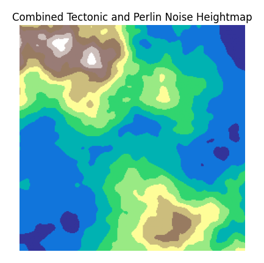
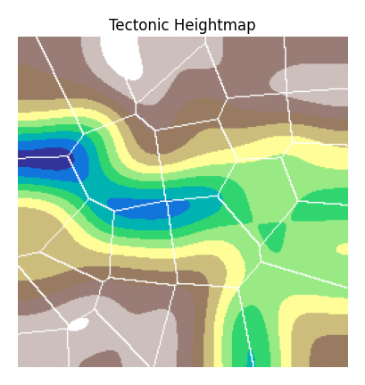
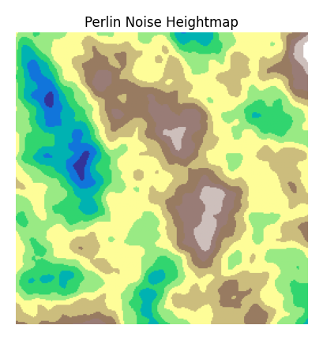

# Wave-Function-Collapse

This project was inspired by the process of WFC, but has since evolved to seeing how realistic of an image I can get.

## API

The tools found in the `modules` directory contain different random generation functions. Each one has a `generate()` function which is used after initialization
to return back the final generated array.

## Example (Techtonic \* Perlin)

The above map is a combination of using a tectonic generation for producing the general land features and fault lines and then multiplying that result with random noise generated from a Perlin noise generator.

---

This map is the underlying tectonic heightmap. It also includes the tectonic plates for visual reference to see where some plates converge (mountains) and others diverge (valleys). This helps with generating larger land masses in a random, but realistic way based on plates moving in random directions. It is then smoothed out to produce a nice gradient giving it a more realistic look.

However, tectonic plate movement as seen is very smooth due to the gradient smoothing operation applied. This is why we need more detailed noise...

---

This map is that more detailed noise. By adjusting parameters you can adjust how "hard" of edges you want and how many features (mountains/valleys) you want in this image. Because this is more "random" noise, it is better at creating islands and more natural looking edges.

When you take the multiple of both the Tectonic and Perlin heightmaps, this is where you combine large features with small features which generates a pleasing and interesting map.
